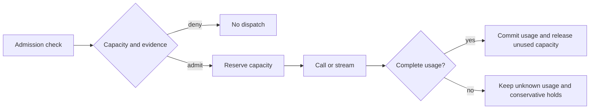

# Admission budgets

`budget_policy` adds run-local capacity checks to the [Python harness](HARNESS.md).
It checks explicit model, tool, iteration, and completion boundaries. It does not
discover hidden calls or change model names, prompts, context, or SDK options.

```python
from agentloop.budget_types import DispatchOptions, Reservation, ResourceUsage
from agentloop.budgets import BudgetLimits, budget_policy
from agentloop.harness import Harness, HarnessConfig

policy = budget_policy(
    BudgetLimits(max_model_calls=2, max_tokens=20, max_cost_usd=0.006),
    soft_fraction=0.5, unknown_usage="deny",
)
run = Harness(HarnessConfig(mode="enforce", policies=(policy,))).start_run("task-01")

# Protocol fake: synthetic values, not provider prices or measurements.
def model():
    return {"text": "synthetic result", "tokens": 8, "cost": 0.002}

def read_usage(reply):
    return ResourceUsage(
        tokens=reply["tokens"], cost_usd=reply["cost"],
        token_provenance="user_supplied", cost_provenance="user_reported",
        complete=True,
    )

call = run.wrap(
    model, boundary="model",
    dispatch=DispatchOptions(Reservation(
        tokens=10, cost_usd=0.003, provenance="upper_bound", pricing_known=True,
        evidence_refs=("synthetic-pricing-v1",),
    )),
    usage_reader=read_usage,
)
first, second = call(), call()
# A third call raises HarnessDeniedError before invoking model.
```

Run `uv run python examples/harness_budgets.py` for the complete offline example.
It retains the denied third attempt and prints a budget snapshot. This tests
admission and accounting, not real-world savings.

## Limits and scope

`BudgetLimits` accepts optional `max_model_calls`, `max_tool_calls`,
`max_iterations`, `max_retries`, `max_tokens`, `max_cost_usd`, and `deadline_at`.
Counts must be nonnegative integers; monetary/deadline values must be finite and
nonnegative. Zero is valid. `soft_fraction` is optional and ranges from zero to
one: reaching it records a soft threshold without denying an otherwise valid
call. Final admission limits still apply.

The policy uses serialized harness hooks to reserve capacity atomically before
work starts. Concurrent branches share one run and cannot all consume its last
slot. Reservation totals are maintained incrementally; checks do not scan other
in-flight calls. Protected work runs outside the hook lock.



Another policy can deny after a reservation is made. Cleanup refunds capacity
when `dispatched=false`; it does not classify unexecuted work as billed. Once
invocation was attempted, failure or cancellation may still be billable. Missing
usage stays unknown and a known conservative bound remains held. Capacity refunds
are accounting changes, not requests for provider refunds.

Call limits apply to declared wrappers. Token/cost accounting applies to `model`
by default; include `tool` in `metered_boundaries` for paid tools. `boundaries`
can narrow supported hooks, but cannot omit a configured call limit's boundary
or leave a token/cost limit without a metered boundary. Unwrapped calls and
unselected metered boundaries are outside the budget.

Share one `HarnessRun` across branches of one execution. Reusing the immutable
policy in another run creates separate state with a distinct `budget_scope_id`,
even if a caller reuses a run label. A new run or process does not recover earlier
usage; checkpoint recovery is separate work. Snapshots are cumulative within a
scope and must not be summed.

## Reservations and provenance

`Reservation` declares conservative upper bounds for one invocation. Token
admission needs an explicit `upper_bound`; cost admission also needs
`pricing_known=True`. Optional `evidence_refs` identify reviewed rate/configuration
evidence without fetching it. Word-count approximations and missing prices never
silently become zero reservations.

The caller must configure actual provider limits and include all relevant work
in the bounds. The Python wrapper does not alter request options or prove that a
remote service obeyed a declaration. Snapshots therefore say
`hard_spend_cap=false`, label configured spend/token enforcement as `best_effort`
(or `shadow`), and explicitly allow possible spend overshoot. Observed bound
violations retain the realized excess and escalate rather than increasing a
limit, rerouting models, or discarding context.

`ResourceUsage` is a normalized, payload-free snapshot. Admission-eligible usage
needs `complete=True` and `exclusive=True`. Exact token bases are `provider`,
`tokenizer`, and `user_supplied`; legacy, unspecified, unavailable, and
`estimated_words` counts remain unknown to the budget.

Provider-reported and explicitly user-reported costs can be known independently
of token counts. `calculated` cost additionally requires known pricing and an
exact token basis. Estimated, unavailable, incomplete, or nonexclusive cost is
unknown. Known amounts retain their basis; calculated values are not promoted
to verified provider billing.

The explicit synchronous `usage_reader` receives the result or yielded stream
chunks and returns `ResourceUsage` or `None`. Return `None` when usage is absent;
never substitute zero. Only normalized fields survive the callback. Ordinary
collector errors become safe unknown-usage diagnostics; raw results and exception
messages are not retained. Cancellation/process-control exceptions keep their
identity.

## Unknown usage and repeated reports

| `unknown_usage` | Before dispatch | After attempted work with unavailable required usage |
| --- | --- | --- |
| `deny` (default) | Deny the call | Stop future admission and raise a control signal |
| `escalate` | Escalate for host intervention | Escalate and stop future admission |
| `monitor_only` | Continue with explicit uncertainty, subject to known capacity limits | Retain unknown usage/holds and continue unless a known limit or bound was exceeded |

Missing data changes admission only for the token/cost limits configured. A
count-only policy works without a usage collector while resource measurements
remain unavailable. Shadow mode does not apply control actions and accounts for
work that really runs even when it proposed a denial.

Stream usage updates replace the previous snapshot; cumulative chunks are not
summed. Closing/cancelling before final usage retains an unknown charge and its
bound. A normal function returning an SDK stream exposes only its factory call:
use an explicit generator/async-generator wrapper for the full streaming lifetime.

Optional `usage_id` must identify the same billable usage unit, not a model name,
task ID, or merely a reused resource identifier. Identical complete reports with
that identity are charged once; conflicts remain unknown. Omit the ID when that
identity cannot be established. Dispatch/retry counters still count every
attempted wrapper call. Earlier incomplete reports are not silently rewritten.
Parent usage that includes nested budgeted work must use `exclusive=False`; those
totals are not added again as known usage.

## Retries and deadlines

`DispatchOptions(retry_source="framework" | "provider" | "harness")` explicitly
marks an additional attempt. Every attempt needs admission and contributes to
the retry limit and its source counter. Nothing is automatically retried. Do not
mark both parent orchestration and the same child attempt as one retry. Hidden
SDK attempts without exposed dispatch hooks are not claimed as controlled.

`deadline_at` is absolute in the supplied monotonic clock's domain:

```python
import time
limits = BudgetLimits(deadline_at=time.monotonic() + 30)
```

The default is `time.monotonic`; a synchronous clock can be supplied for tests.
Checks occur at admission/reservation. Already admitted work may finish later,
and scheduling or other hooks can delay its actual start. This is cooperative
admission control, not a hard runtime timeout. It cannot kill arbitrary blocking
code or undo remote side effects. Invalid/regressing clocks fail closed; completed
usage is still reconciled after an ordinary clock-read error.

## Evidence and compatibility

Budget snapshots use schema 1.0 within [decision evidence](HARNESS_EVIDENCE.md).
They retain limits, scope, unknown-usage policy, soft thresholds, committed usage,
reservations, capacity refunds, unknown holds, retry origins, provenance, and
observed overshoot. Totals stay null when measurements are unknown. Cost arithmetic
is exact over declared decimal inputs; cost totals and limits are decimal strings
to avoid cumulative binary-float drift at an admission boundary.

These closed numeric snapshots include resource limits even when generic raw
policy-configuration capture is disabled. They contain no prompts, arguments,
outputs, or credentials. IDs and budget/usage amounts can still be private.
Native JSON, supported OTLP round trips, and existing intervention storage retain
the snapshots without a new database migration. Hook timing covers policy
evaluation; usage extraction and evidence serialization are outside those intervals.

Disabled wrappers return the original callable and never collect usage. Existing
wrappers without new options keep their lifecycle behavior. Identical repeated
wrapping is a no-op; changing dispatch/collector settings requires wrapping the
original callable, preventing accidental nested accounting. This is an opt-in
control layer, not a global billing service, scheduler, sandbox, or provider quota
replacement.
