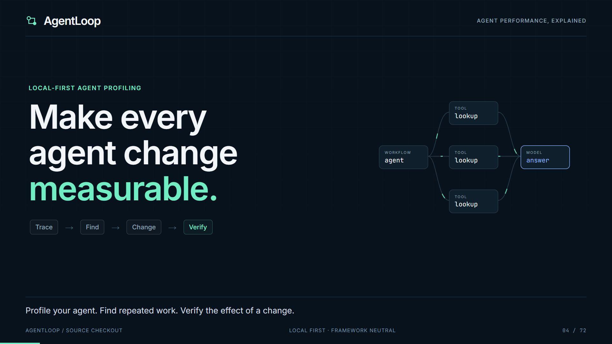

# AgentLoop demo video

A 72-second, 1920 × 1080, 30 fps walkthrough made with
[Remotion](https://github.com/remotion-dev/remotion). It has animated captions
and no voiceover or music, so it works when viewed muted.



The demo covers a local quickstart, Python instrumentation, finding evidence,
baseline/candidate replay, a six-pair study with a failed-quality case, and an
offline HTML report. All displayed timings and outcomes come from AgentLoop's
deterministic synthetic example. They are labeled as demonstration data, not
real-world performance claims. The commands use a current source checkout.

## Render or edit

Requires Node.js 22 or newer. From this directory:

```bash
npm ci
npm run check
npm run studio
```

Select `AgentLoopDemo` in Remotion Studio. Edit [the scenes](src/Video.tsx) and
[the timing/captions](src/storyboard.json), then export:

```bash
npm run render
```

Output: `out/agentloop-demo.mp4` and `out/agentloop-demo.srt`. The video includes
the captions visually; the SRT is also provided for platforms accepting a caption
track. The first render may download Remotion's browser. Fonts are bundled by npm
and do not require a font CDN during rendering.

`npm run stills` renders one representative PNG per scene. `npm run smoke` renders
those frames and a one-second encoded sample. Use `-- --concurrency 4` to change
render concurrency, or `-- --browser /path/to/chrome` to use an installed compatible
Chromium browser. `--output` changes the artifact directory.

The [Demo video workflow](../.github/workflows/demo-video.yml) checks the source
data, validates TypeScript, renders the full MP4, and uploads an `agentloop-demo`
artifact. It also supports manual runs from
[GitHub Actions](https://github.com/dipeshbabu/agentloop/actions/workflows/demo-video.yml).

## Refresh the evidence

The checked-in [data snapshot](src/demo-data.json) includes the source commit,
traces, original finding/estimator, replay results, and study outcomes. The
[CLI transcript](public/cli-transcript.txt) records the actual commands' output.
The terminal and timeline visuals are animated recreations using these facts;
they are not a live screen recording.

From the repository root:

```bash
uv run --frozen python video/scripts/prepare-data.py
uv run --frozen python video/scripts/prepare-data.py --check
```

Preparation runs `examples/intervention_study.py`, quickstart, analyze, replay,
study summary, and HTML export. `--check` verifies that freshly generated facts
and HTML match the committed snapshots, ignoring the source commit field.
Generated run files stay under `runs/video-evidence/`.

[report.png](public/report.png) is a browser capture of
[the generated HTML report](public/report.html) at 1600 × 1100. If the report
layout changes, recapture it from that file with a browser before rendering the
video. Review the representative frames after changing the story or assets.

## Source and asset terms

The composition, diagrams, captions, and scripts are original project source
under AgentLoop's Apache-2.0 license. Remotion retains its
[Remotion License](https://github.com/remotion-dev/remotion/blob/main/LICENSE.md).
Inter and JetBrains Mono retain their SIL Open Font License terms in the installed
Fontsource packages. React and the other authoring dependencies retain their own
licenses. See [the dependency inventory](../THIRD_PARTY_LICENSES.md).

This optional authoring project is excluded from the application container and
does not add Node or Remotion to the Python runtime dependencies. Generated video
and browser/build caches are ignored by Git.
